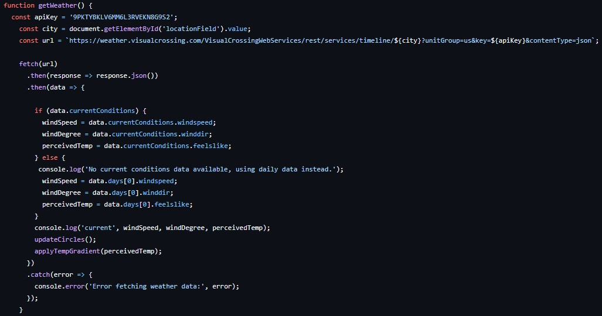

# Live Wind Monitor
## Visualize the wind and percieved temperature in any given location; powered by live weather data!

the html and css are pretty apparent in their functionality so I will focus on the javascript in this readme

### getWeather.js:

**I first define the variables I want to track:**
- windSpeed
- windDegree (the direction of the wind in degrees)
- percievedTemp

These will later be fed into the p5js canvas to visualize them

**We now need to get the data from the API**



This code runs when you press the visualize button on the website! It takes live data from the API if available and the daily average if not and feeds it into the variables we defined earlier.

**The background color**

This is just a linear gradient generated using some math, hsl colors, and the percieved temperature data.

### windDisplay.js

The only thing that we really need to worry about is the updateCircles function
```javascript
function updateCircles() {
  circles = [];
  for (let i = 0; i < 50; i++) {
    circles[i] = new windCircles(windSpeed, windDegree, perceivedTemp);
  }
 ``` 
This deletes the previous circles and generates a new set; every other variable used in the circles is randomly generated upon their creation.

The rest is basic p5js!

